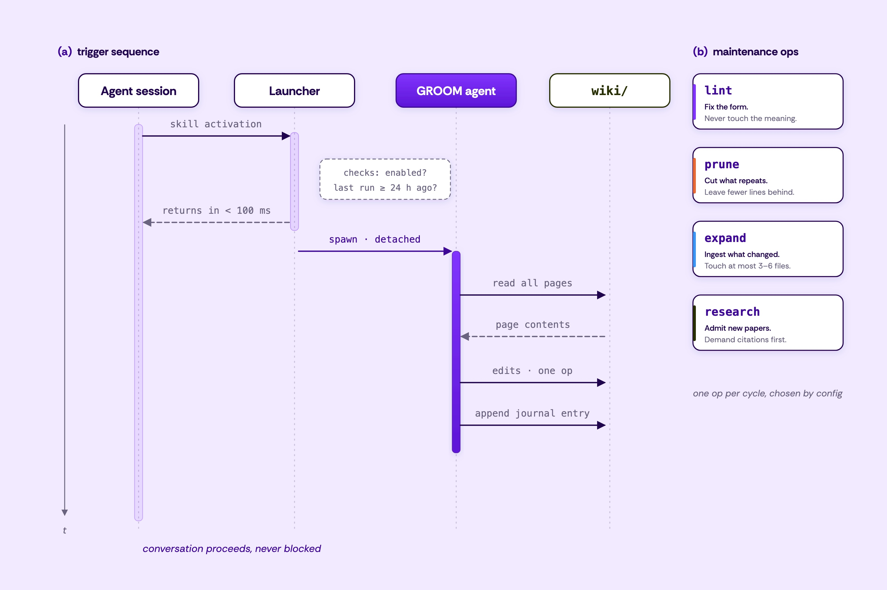

<div align="center">

# GROOM
### Gated Refresh of Organizational Memory

**A self-maintaining knowledge base for AI agents — consulting it is the act that keeps it current.**


[**Read the survey →**](https://labs.beconfident.app/papers/harness-engineering-survey)



</div>

---

## The problem

An LLM agent is only as current as the text it reads. Production agents ground on curated
corpora — internal wikis, convention docs, runbooks, retrieval indices — and those corpora
**rot**: the field moves, the text does not, and every agent that loads a stale page is
silently degraded. Context engineering manages the *window* (what reaches the model at
inference time); almost nobody maintains the *source*.

We made the cost concrete. When a consuming agent treats a corpus as authoritative, injecting
staleness into five facts dropped its answer accuracy on those facts **from 100% to 0%** while
untouched controls held at 100%. Corpus correctness is load-bearing — and maintaining it is
nobody's immediate job, so it doesn't happen.

## What GROOM does

GROOM makes **consulting the knowledge base the act that maintains it.** A consuming agent
reads the corpus through a skill; that fires a gated launcher which returns in tens of
milliseconds and, when a refresh is due, spawns a *detached* agent to run **one** bounded
maintenance operation (lint, prune, expand, research, or iterate). The read never blocks; the
next reader gets the benefit (stale-while-revalidate, for knowledge).

Autonomous edits to a live corpus are the real risk, so **every operation is wrapped in a git
checkpoint behind a deterministic, token-free validator.** An edit "counts" only if it reports
terminal success, passes structural *and* fact-level validation, satisfies its postcondition,
and touched nothing outside the corpus — otherwise the working tree is reset to the
pre-operation commit. A bad edit becomes a recoverable no-op, never a committed corruption.

GROOM is **content-agnostic** (point it at any markdown knowledge base, or scaffold a fresh
one) and **retrieval-agnostic** (it maintains clean markdown; how an agent retrieves —
progressive disclosure, full-context, BM25, dense — is a pluggable layer, not GROOM's concern).

## Results

Every number below is reproduced by the harness in [`eval/`](eval/) — **no agent calls, no
network** (single laptop, Node 22; timings are load-sensitive).

| Property | Result |
|---|---|
| **Staleness matters** | A consuming agent's accuracy on affected facts collapses **100% → 0%** under corpus staleness; controls hold at 100%. |
| **Safety** | Across **9 fault classes**, the gate rejects every one and restores the corpus byte-identically to the checkpoint (n=450, ~13 ms median). A no-gate baseline that commits unconditionally corrupts the corpus **9/9**. |
| **Concurrency** | The naive debounce stamp is a TOCTOU race — it resolves an 8-way trigger to one run only **28–59%** of the time. An atomic `mkdir` claim fixes it to **500/500**. |
| **Cost** | The validation gate is linear (**tens of µs/page**, ~14–27 ms at 400 pages, load-sensitive); the read path adds a warm ~50 ms and never blocks. |
| **Canaries** | Structural validation alone misses **5/5** semantic-loss injections; fact-level canaries catch all 5 — at zero token cost. |
| **Generalization** | Across **3 unrelated agent-KB domains** (an internal API/SDK reference, an SRE runbook, a SaaS support KB) and **2 retrievers** (BM25 + dense), grooming yields a **45–51% relative gain in recall@1** (BM25 0.52→0.78, dense 0.56→0.81); a groomed corpus is **~40% smaller**. |

## Quickstart

```bash
npm install
npm test                       # 11-test behavior suite — free, no agent calls
node eval/fault-matrix.mjs     # reproduce the safety benchmark — also free

npm run lint                   # first real maintenance run (spends one agent cycle)
node pipeline/run.mjs status   # free health check: validity, drift, last run
```

Requirements: Node ≥ 20 and [Claude Code](https://claude.com/claude-code) installed and
authenticated. The pipeline runs on **your Claude Code defaults** — the
[Agent SDK](https://docs.claude.com/en/api/agent-sdk/overview) shares the CLI's auth and model,
so upgrading your CLI upgrades the maintenance agent with it.

### Point GROOM at any knowledge base — or bootstrap one

```bash
GROOM_CORPUS=docs node pipeline/run.mjs init "My Project Docs"   # scaffold a valid, groomable corpus
GROOM_CORPUS=docs node pipeline/run.mjs expand                   # populate it from the field
```

`init` writes the minimal valid skeleton (`index.md`, `sources.md`, `glossary.md`,
`_meta/canaries.json`, journal) so a new corpus passes the validator from its first commit.

## How it works

**The trigger.** The bundled skill is lazily loaded — it costs ~one line of context until a
relevant question arises, then fires `pipeline/background-refresh.mjs`. The launcher checks
three gates and returns in <100 ms: *enabled?*, *due?* (a debounce stamp, default 24 h), and
*claimed?* (an atomic `mkdir` claim that serializes simultaneous triggers to exactly one run).
Consulting the wiki **is** the maintenance trigger.

**The operations** are discovered from `pipeline/prompts/` — every `<op>.md` is a runnable op,
so adding one is dropping a file:

| Command | What it does | Invariant |
|---|---|---|
| `npm run lint` | Fix frontmatter, links, style drift | Never changes meaning |
| `npm run prune` | Cut duplication, merge overlap | Net line count must go **down** |
| `npm run expand` | Web-research what changed; add the 2–4 most consequential things | Touches 3–6 files |
| `npm run research` | Ingest recent arXiv work | Citation-gated; zero additions is valid |
| `npm run iterate` | Find the single weakest page and make it good | One page; validator-gated |
| `npm run all` | Cron entrypoint | `research → expand → lint → prune` |

**The gate.** Each op is checkpointed: commit → run (with a per-op capability set and a
path-fence) → validate (structure + canaries) + postcondition + fence check → commit, or
`git reset --hard`. The validator (`pipeline/validate.mjs`) costs zero model tokens and is
reused as a CI test and a free `status` command. Load-bearing facts are guarded by
`wiki/_meta/canaries.json`; an op that legitimately moves a fact updates its canary in the
same commit.

```jsonc
// pipeline/config.json
{
  "corpus": "wiki",            // which knowledge base GROOM maintains (any path; env GROOM_CORPUS overrides)
  "background_refresh": {
    "enabled": true,           // master toggle, checked at consult time
    "op": "lint",              // which cycle to run: lint | prune | iterate | expand | all
    "min_interval_hours": 24,  // debounce: at most one spawn per interval
    "log_file": "cron/background-refresh.log"
  }
}
```

Cron (`cron/crontab.example`, `cron/launchd.plist.example`) is available as a belt to the
skill's suspenders — for corpora consulted rarely but that should stay fresh.

## This instance: harness engineering

The bundled `wiki/` is a knowledge base on **harness engineering for AI agents** — the
control, execution, safety, evaluation, and training infrastructure around LLMs. The repo eats
its own cooking: a knowledge base about agent infrastructure, maintained by agent
infrastructure. It is also the corpus behind the companion survey linked above.

```
wiki/                     the knowledge base (19 pages + meta)
  index.md                map of content — agents and humans start here
  _meta/canaries.json     load-bearing facts that must survive maintenance
pipeline/
  run.mjs                 maintenance runner + checkpoint gate
  validate.mjs            deterministic, token-free validator (structure + canaries)
  background-refresh.mjs  the consultation-triggered launcher
  prompts/                one prompt per operation + shared conventions
eval/                     reproducible mechanism benchmarks (fault matrix, scaling, concurrency, ablation, outcome, IR)
.claude/skills/           the Claude Code skill that teaches agents to consult the wiki
.claude/agents/groom.md   subagent returning a structured "groomed brief"
```

## Using it as agent context

**Claude Code (recommended):** anyone running Claude Code inside this repo gets the skill
automatically. To use it from other projects, symlink it user-level:

```bash
mkdir -p ~/.claude/skills && ln -s "$(pwd)/.claude/skills/harness-wiki" ~/.claude/skills/harness-wiki
```

**Other agents (Codex, Cursor, anything):** the skill is one trigger adapter — the engine is
agent-neutral. Point your agent at `wiki/index.md` (read the index, load only pages whose
`summary` matches, trust `established` pages, hedge `emerging` ones), and invoke
`node pipeline/background-refresh.mjs` from a hook or tool call to make consumption trigger
maintenance.

## Fork it for your own knowledge base

1. Run `init` (or replace `wiki/*.md`, keeping `index.md`, `sources.md`, `glossary.md`, `_meta/`).
2. Edit `pipeline/prompts/_conventions.md` — it defines the domain, audience, and style.
3. Point `expand.md` at your field's primary sources; seed canaries for your load-bearing facts.
4. Schedule `npm run all`, or let consultation drive it. Read the journal; the pipeline is
   trustworthy-with-oversight, not autonomous.

## License

MIT
